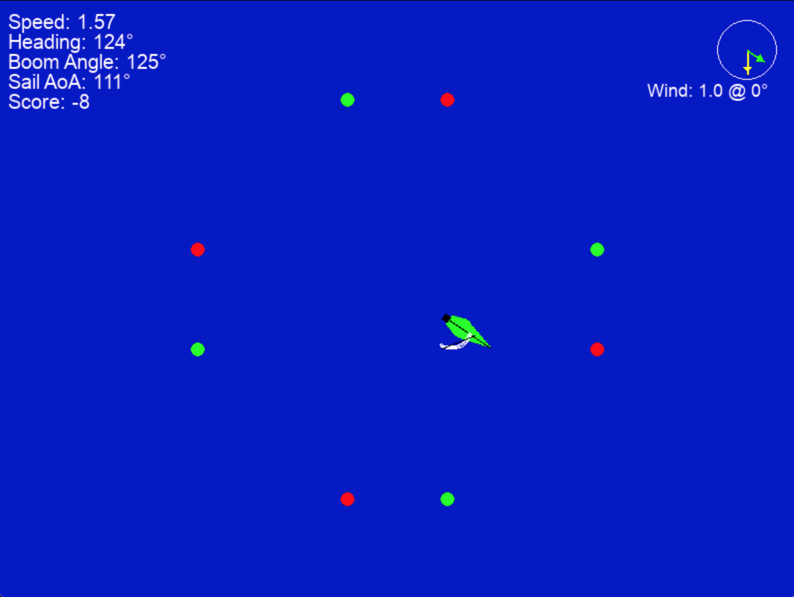

# Simulation de Voile Pygame

Une simple simulation de voile construite avec Pygame en Python.

## Description

Ce projet simule la navigation d'un bateau à voile, incluant la physique de base du vent et de la voile, la direction, et l'interaction avec des portes de parcours. Le joueur contrôle l'angle du bateau et l'orientation de la bôme pour naviguer.

## Capture d'écran




## Fonctionnalités

*   Mouvement du bateau basé sur l'angle du vent et de la voile.
*   Contrôle manuel de la direction du bateau.
*   Ajustement manuel de l'angle de la bôme.
*   Passage automatique de la bôme (empannage/virement de bord).
*   Indicateur de vent et d'orientation du bateau.
*   Système de portes de parcours avec détection de passage et score.
*   Affichage d'informations en temps réel (vitesse, cap, angle de bôme, AoA de la voile, score).
*   Possibilité de changer la direction du vent.

## Comment exécuter

1.  **Prérequis :**
    *   Python 3.x
    *   Pygame

2.  **Installation de Pygame :**
    Si vous n'avez pas Pygame d'installé, ouvrez votre terminal ou invite de commandes et tapez :
    ```bash
    pip install pygame
    ```

3.  **Lancer la simulation :**
    Naviguez jusqu'au répertoire où vous avez cloné ou téléchargé les fichiers et exécutez :
    ```bash
    python main.py
    ```

## Contrôles

*   **Flèche Gauche :** Tourner le bateau vers bâbord (gauche).
*   **Flèche Droite :** Tourner le bateau vers tribord (droite).
*   **Flèche Haut :** Border la bôme (réduire son angle par rapport à l'axe du bateau).
*   **Flèche Bas :** Choquer la bôme (augmenter son angle par rapport à l'axe du bateau).
*   **Touche 'W' :** Changer la direction du vent (rotation anti-horaire).
*   **Touche 'S' :** Changer la direction du vent (rotation horaire).

## Structure du Code

*   `main.py`: Contient la logique principale du jeu, la boucle de jeu, la gestion des événements, et les classes `Boat` et `Gate`.

    *   **Constantes :** Définissent les couleurs, dimensions de l'écran, propriétés du bateau, du vent, de la voile, du gouvernail et des portes.
    *   **Classe `Boat` :**
        *   Gère la position, l'angle, la vitesse du bateau.
        *   Calcule la physique de la voile et du mouvement.
        *   Gère la rotation et le dessin du bateau, de la bôme et de la voile.
        *   Inclut la logique pour l'ajustement manuel et automatique de la bôme.
    *   **Classe `Gate` :**
        *   Définit une porte de parcours avec deux bouées.
        *   Vérifie si le bateau passe correctement à travers la porte et attribue des points.
    *   **`draw_wind_indicator()` :** Fonction pour dessiner l'indicateur de vent et de cap du bateau.
    *   **`main_simulation()` :** Fonction principale qui initialise Pygame, crée les objets du jeu, et contient la boucle de jeu principale.

## Améliorations Possibles

*   Physique du vent plus avancée (vent apparent).
*   Effet du gouvernail plus réaliste.
*   Différents types de voiles.
*   Interface utilisateur plus élaborée.
*   Niveaux ou parcours multiples.
*   Effets sonores.

